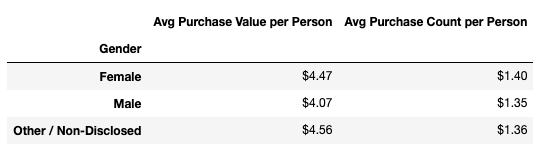
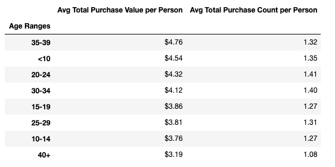
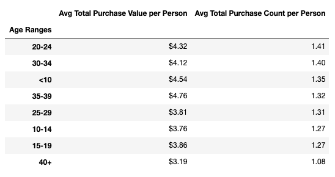
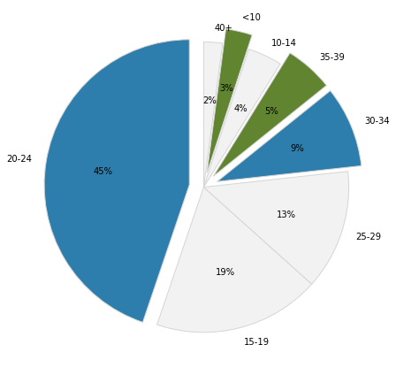
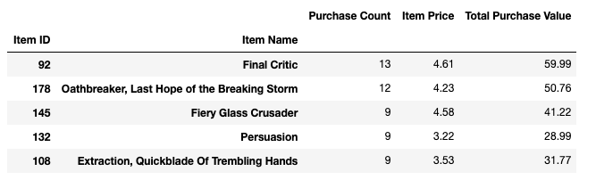
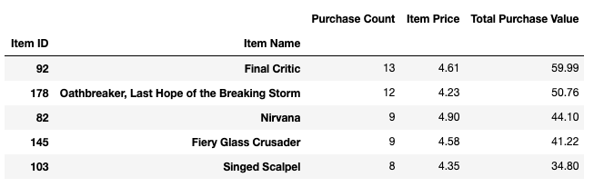

# pandas-challenge
<strong>HeroesOfPymoli and  PyCitySchools using Python Pandas</strong>

# Heroes of Pymoli
In this project, we have to analyze the data of fantasy game "Heroes of Pymoli". The game is free-to-play, but players are encouraged to purchase optional items that enhance their playing experience. 

<div style="text-align:center"></div>

## Dataset:  <a href="HeroesOfPymoli/Resources/purchase_data.csv">Here</a>

## Tasks
We have <strong>to generate a report that breaks down the game's purchasing data into meaningful insights.<strong>
Final report should include each of the following:

- Player Count
  - Total Number of Players
- Purchasing Analysis (Total)
  - Number of Unique Items
  - Average Purchase Price
  - Total Number of Purchases
  - Total Revenue
- Gender Demographics
  - Percentage and Count of Male Players
  - Percentage and Count of Female Players
  - Percentage and Count of Other / Non-Disclosed
- Purchasing Analysis (Gender): The below each broken by gender
  - Purchase Count
  - Average Purchase Price
  - Total Purchase Value
  - Average Purchase Total per Person by Gender
- Age Demographics: The below each broken into bins of 4 years (i.e. <10, 10-14, 15-19, etc.)
  - Purchase Count
  - Average Purchase Price
  - Total Purchase Value
  - Average Purchase Total per Person by Age Group
- Top Spenders: Identify the the top 5 spenders in the game by total purchase value, then list (in a table):
  - SN
  - Purchase Count
  - Average Purchase Price
  - Total Purchase Value
- Most Popular Items: Identify the 5 most popular items by purchase count, then list (in a table):
  - Item ID
  - Item Name
  - Purchase Count
  - Item Price
  - Total Purchase Value
- Most Profitable Items: Identify the 5 most profitable items by total purchase value, then list (in a table):
  - Item ID
  - Item Name
  - Purchase Count
  - Item Price
  - Total Purchase Value
  
 ## Codebase
 Please refer the jupyter notebook <a href="HeroesOfPymoli/HeroesOfPymoli.ipynb">here</a>
 
 ## Conclusion
 
 Please refer the report <a href="HeroesOfPymoli/Report-Pymoli.docx">here</a>
 
``` diff
Though, male players outnumber females and the other category, a key point to note here is that average 
female player spending is more than that of a male player both in terms of purchase value and count. 
This implies that,  
+ the gaming company need to market more to attract female players as they tend to purchase more.

```
<div style="text-align:center"><p>Male Vs Female Purchase Trends</p></div>
 
``` diff
Majority of players belong to the 20-24 Age group. Though these players are the ones
who buy the most (1.41 purchases / person) compared to others, they are buying cheaper
compared to high spending age groups 35-39 and <10. The same behavior can be observed
by 30-34 age group also. 
+ Hence, these age groups (20-24 & 30-34) can be targeted with discounts. 
+ They will buy more in number but with moderate prices. 

We can also see that, the age groups 35-39 and <10 are the ones who spend the most (4.76 and 4.54 per person
respectively). However, they are only 8% of the total players. 
+ There is a huge opportunity if the company could market effectively to attract these groups as they tend to purchase more.
```
<div style="text-align:center"><p>Age groups sorted (descending order) by value of purchase</p></div>
<div style="text-align:center"><p>Age groups sorted (descending order) by count of purchase</p></div>

<div style="text-align:center"></div>

``` diff
The most popular and profitable items are "Final Critic" and "Oathbreaker, Last Hope of the Breaking Storm". 
- They are sold NOT because of low price. 
Both of them are expensive, compared to other items (placed above 80% of all product prices). Still, players are buying them considerably; means, 
- there are some unique features in those products that help the players cross certain stages or achieve some popular targets. 
+ The company shall experiment on increasing the prices of these products, also introduce products with similar features and price ranges.
```
<div style="text-align:center"><p>Most popular Top5 items</p></div>
<div style="text-align:center"><p>Most profitable Top5 items</p></div> 
 
 
 # PyCitySchools
 In this project, we need to help making strategic decisions regarding future school budgets and priorities. We have to analyze the district-wide standardized test results. 
 <div style="text-align:center"></div>
 
# Dataset:  
<p><a href="PyCitySchools/Resources/schools_complete.csv">Schools Data Here</a></p>
<p><a href="PyCitySchools/Resources/students_complete.csv">Students Data Here</a></p>

# Tasks
We are given access to every student's math and reading scores, as well as various information on the schools they attend. We need <strong>to aggregate the data to and showcase obvious trends in school performance.</strong>

Final report should include each of the following:

- District Summary: Create a high level snapshot (in table form) of the district's key metrics, including:
  - Total Schools
  - Total Students
  - Total Budget
  - Average Math Score
  - Average Reading Score
  - % Passing Math (The percentage of students that passed math.)
  - % Passing Reading (The percentage of students that passed reading.)
  - % Overall Passing (The percentage of students that passed math and reading.)
- School Summary: Create an overview table that summarizes key metrics about each school, including:
  - School Name
  - School Type
  - Total Students
  - Total School Budget
  - Per Student Budget
  - Average Math Score
  - Average Reading Score
  - % Passing Math (The percentage of students that passed math.)
  - % Passing Reading (The percentage of students that passed reading.)
  - % Overall Passing (The percentage of students that passed math and reading.)
- Top Performing Schools (By % Overall Passing): Create a table that highlights the top 5 performing schools based on % Overall Passing. Include:
  - School Name
  - School Type
  - Total Students
  - Total School Budget
  - Per Student Budget
  - Average Math Score
  - Average Reading Score
  - % Passing Math (The percentage of students that passed math.)
  - % Passing Reading (The percentage of students that passed reading.)
  - % Overall Passing (The percentage of students that passed math and reading.)
- Bottom Performing Schools (By % Overall Passing): Create a table that highlights the bottom 5 performing schools based on % Overall Passing. Include all of the same metrics as above.
- Math Scores by Grade: Create a table that lists the average Math Score for students of each grade level (9th, 10th, 11th, 12th) at each school.
- Reading Scores by Grade: Create a table that lists the average Reading Score for students of each grade level (9th, 10th, 11th, 12th) at each school.
- Scores by School Spending: Create a table that breaks down school performances based on average Spending Ranges (Per Student). Use 4 reasonable bins to group school spending. Include in the table each of the following:
  - Average Math Score
  - Average Reading Score
  - % Passing Math (The percentage of students that passed math.)
  - % Passing Reading (The percentage of students that passed reading.)
  - % Overall Passing (The percentage of students that passed math and reading.)
- Scores by School Size: Repeat the above breakdown, but this time group schools based on a reasonable approximation of school size (Small, Medium, Large).
- Scores by School Type: Repeat the above breakdown, but this time group schools based on school type (Charter vs. District).
